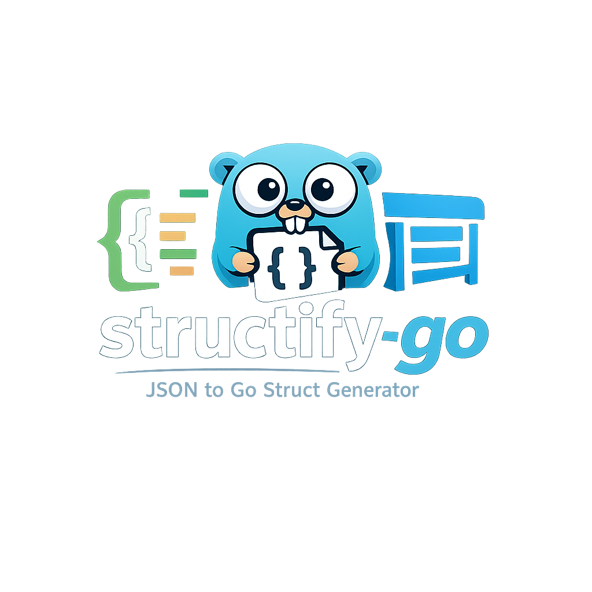

<p align="center">
  
</p>

# structify-go

`structify-go` คือ Go CLI ตัวเล็ก ๆ ที่ช่วยเปลี่ยน JSON ให้กลายเป็น Go struct พร้อม `json` tags แบบอัตโนมัติ

ถ้าคุณมี JSON อยู่ในมือ แล้วไม่อยากนั่งพิมพ์ struct เองทีละ field เครื่องมือนี้เกิดมาเพื่อช่วยตรงนั้นเลยครับ

รองรับทั้งการอ่านจากไฟล์และการรับข้อมูลผ่าน `stdin`, จัดการ object/array ที่ซ้อนกันได้ และส่งผลลัพธ์ออกทาง `stdout` หรือบันทึกลงไฟล์ก็ได้

## ทำอะไรได้บ้าง

- แปลง JSON object เป็น Go struct ที่พร้อมใช้งาน
- อ่านข้อมูลจาก `-input` หรือจากการ pipe ผ่าน `stdin`
- เขียนผลลัพธ์ออกจอ หรือบันทึกลงไฟล์ผ่าน `-output`
- เก็บชื่อ key เดิมของ JSON ไว้ใน `json` tags
- รองรับข้อมูลพื้นฐาน, object ซ้อน, array, `null` และ empty array
- เรียง field ตามตัวอักษร เพื่อให้ output ออกมาเสถียรและเทียบ diff ง่าย
- reuse nested struct ที่มีโครงสร้างเหมือนกัน
- format โค้ดที่สร้างออกมาด้วย standard library ของ Go

## ติดตั้ง

ถ้าอยาก build ไว้ใช้ในโฟลเดอร์นี้:

```bash
go build -o structify-go ./cmd/structify-go
```

ถ้าอยากติดตั้งลงใน Go bin:

```bash
go install ./cmd/structify-go
```

## ลองใช้เร็ว ๆ

อ่านจากไฟล์:

```bash
structify-go -input examples/sample.json -name UserResponse
```

อ่านจาก `stdin`:

```bash
cat examples/sample.json | structify-go -name UserResponse
```

สร้างไฟล์ออกมาเลย:

```bash
structify-go -input examples/sample.json -name UserResponse -output model.go
```

กำหนด package name เอง:

```bash
structify-go -input examples/sample.json -name UserResponse -package models -output model.go
```

## ตัวอย่างอินพุต

ไฟล์ `examples/sample.json`

```json
{
  "active": true,
  "age": 30,
  "metadata": null,
  "profile": {
    "email": "alice@example.com",
    "score": 98.5
  },
  "projects": [
    {
      "id": 101,
      "name": "Structify",
      "tags": ["go", "json"]
    }
  ],
  "roles": ["admin", "editor"]
}
```

## ตัวอย่างผลลัพธ์

```go
// Code generated by structify-go; DO NOT EDIT.

package main

type UserResponse struct {
	Active   bool        `json:"active"`
	Age      int         `json:"age"`
	Metadata interface{} `json:"metadata"`
	Profile  Profile     `json:"profile"`
	Projects []Project   `json:"projects"`
	Roles    []string    `json:"roles"`
}

type Profile struct {
	Email string  `json:"email"`
	Score float64 `json:"score"`
}

type Project struct {
	ID   int      `json:"id"`
	Name string   `json:"name"`
	Tags []string `json:"tags"`
}
```

## ถ้าอยากรู้ว่าแต่ละ type ถูกแปลงยังไง

- `string` -> `string`
- `boolean` -> `bool`
- number ที่ไม่มีจุดทศนิยมหรือ exponent -> `int`
- number ที่มีจุดทศนิยมหรือ exponent -> `float64`
- object -> nested struct
- array -> slice ของชนิดข้อมูลที่อนุมานได้
- empty array -> `[]interface{}`
- `null` -> `interface{}`

## คำสั่ง help ของ CLI

ด้านล่างคือข้อความ help จริงที่โปรแกรมแสดง:

```text
Convert JSON into Go struct definitions.

Usage:
  structify-go -input sample.json -name UserResponse
  cat sample.json | structify-go -name UserResponse
  structify-go -input sample.json -name UserResponse -output model.go

Flags:
  -input string
        Path to a JSON file. If omitted, JSON is read from stdin.
  -name string
        Required root struct name for the generated model.
  -output string
        Path to save generated Go code. If omitted, code is printed to stdout.
  -package string
        Package name for the generated Go code. (default "main")
```

## ตัวอย่างการใช้งานจริง

สร้างผลลัพธ์ออกจอจากไฟล์:

```bash
$ ./structify-go -input examples/sample.json -name UserResponse
// Code generated by structify-go; DO NOT EDIT.

package main

type UserResponse struct {
	Active   bool        `json:"active"`
	Age      int         `json:"age"`
	Metadata interface{} `json:"metadata"`
	Profile  Profile     `json:"profile"`
	Projects []Project   `json:"projects"`
	Roles    []string    `json:"roles"`
}

type Profile struct {
	Email string  `json:"email"`
	Score float64 `json:"score"`
}

type Project struct {
	ID   int      `json:"id"`
	Name string   `json:"name"`
	Tags []string `json:"tags"`
}
```

อ่านจาก `stdin` แล้วบันทึกลงไฟล์:

```bash
$ cat examples/sample.json | ./structify-go -name UserResponse -output model.go
$ cat model.go
// Code generated by structify-go; DO NOT EDIT.

package main

type UserResponse struct {
	Active   bool        `json:"active"`
	Age      int         `json:"age"`
	Metadata interface{} `json:"metadata"`
	Profile  Profile     `json:"profile"`
	Projects []Project   `json:"projects"`
	Roles    []string    `json:"roles"`
}

type Profile struct {
	Email string  `json:"email"`
	Score float64 `json:"score"`
}

type Project struct {
	ID   int      `json:"id"`
	Name string   `json:"name"`
	Tags []string `json:"tags"`
}
```

ถ้ายังไม่ได้ส่ง JSON เข้าไป:

```bash
$ ./structify-go -name UserResponse
error: no input provided: pass -input <file> or pipe JSON into stdin
```

ถ้า JSON ไม่ถูกต้อง:

```bash
$ echo '{"broken":' | ./structify-go -name Broken
error: invalid JSON: unexpected EOF
```

## โครงสร้างโปรเจกต์แบบย่อ

- `cmd/structify-go`
  จุดเริ่มต้นของโปรแกรม, การอ่าน input และการเขียน output
- `internal/cli`
  จัดการ flags และ help text
- `internal/parser`
  แปลง JSON และตรวจสอบว่า input มี JSON document เดียว
- `internal/naming`
  ช่วยตั้งชื่อ field/type ให้เป็น Go style มากขึ้น
- `internal/types`
  อนุมาน schema ของข้อมูลแบบ recursive
- `internal/generator`
  สร้าง Go code และจัด format ให้เรียบร้อย

## ข้อจำกัดตอนนี้

- ค่า root ของ JSON ต้องเป็น object
- element ใน array ต้องมีรูปแบบข้อมูลสอดคล้องกัน
- ถ้า array เป็น object ระบบจะใช้ element ตัวแรกเป็นต้นแบบ แล้วตรวจ element ที่เหลือเทียบกับแบบเดียวกัน
- การอนุมาน `int` อิงตาม syntax ของ JSON ไม่ได้อิงขนาด integer ของทุกแพลตฟอร์ม

## พัฒนาในเครื่อง

ถ้าจะลองแก้โค้ดต่อ รันชุดพื้นฐานนี้ได้เลย:

```bash
gofmt -w ./cmd ./internal
go test ./...
go build ./...
```

หรือจะลองเช็ก CLI แบบ manual:

```bash
go run ./cmd/structify-go -input examples/sample.json -name UserResponse
cat examples/sample.json | go run ./cmd/structify-go -name UserResponse
go run ./cmd/structify-go -input examples/sample.json -name UserResponse -output model.go
```
